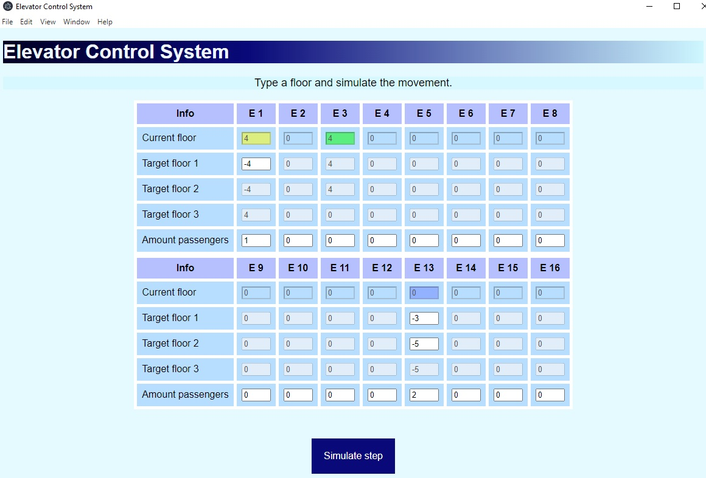

# Description

The application is a simulator of elevators system control.
There are 16 elevators which could process till three target floors.

## Installation

Install the [Node.js](https://nodejs.org/en/download/). The Node Package Manager is needed also and it comes bundled with node. Next clone the repo and type:

```js
npm install
```
in order to download all dependencies needed.

## Usage
To start the app, type:

```js
npm start
```
in your terminal (Git Bash, IDE terminal, etc).

There is a table with the following lines and columns:
- Current floor of the elevator
- Target floors (1,2,3) related to amount of passengers
- Amount passengers provide a number of target floors needed
- E1 - E16 - indexes of elevators

In order to run elevator **choose amount of passengers**, then **select target floors** and run **"Simulate step"** to simulate one step of elevators moving.



If the elevator moves it colorized by *blue*, when it reaches one of several target floors it change color to *yellow*, reaching the last floor the color changes to *green* and with the next step the elevator becomes inactive. The current elevator floor is saved.

Each elevator define the nearest target floor to order all target floors. The prioritization of targets performs after the first step simulation and repeats after reaching each of the target floors.

## How it works?

*Main technologies: Electron.js + Node.js, JS, HTML, CSS, JQuery*.
- **Main.js** starts the window with *index.html* file. The file loads JQuery.js by URL, CSS file for the styles and the renderer.js - brain of the app.
- **renderer.js** provides main funcitonal. It consists of Elevator class, some additional functions and main flow.

renderer.js functional:
- **`Elevator` class** is an object for one elevator with own properties like *current floor*, *passengers number*, *direction* (-1 if goes down and 1 if goes up), *target floor*, *target floors* (list of all targets) and *prioritized target floors* that are sorted in order of arrival by the `prioritizeTargetFloors()` function. Also it provides method `runElevator()` to simulate one step of the elevator and method `nextPassenger()` that starts when one of the target floors is reached.
- **`startAll()`** function starts with loading the app and create 16 object for each elevator with default values.
- **`runSystem()`** function starts with loading the app and runs the system interface, parses all properties of classes created.
- **acceptPassengers()** function reads values from UI and enables/disables html tags.
- **`simulateStep()`** main flow function that monitors all elevators and simulate one step of its moving. It runs `acceptPassengers()`, then, if needed, runs `prioritizeTargetFloors()`, `runElevator()`, `nextPassenger()` and colorize interface. 
- `colorizeBlue()`, `colorizeYellow()`, `colorizeGreen()`, `colorizeWhite()` - functions for colorizing the interface of the specified elevator.

`prioritizeTargetFloors()` algorithm is simple. It sortes all target floors in order of arrival choosing the nearest target floor and repeats when one of the target floors is reached.


## License

[MIT](https://choosealicense.com/licenses/mit/)